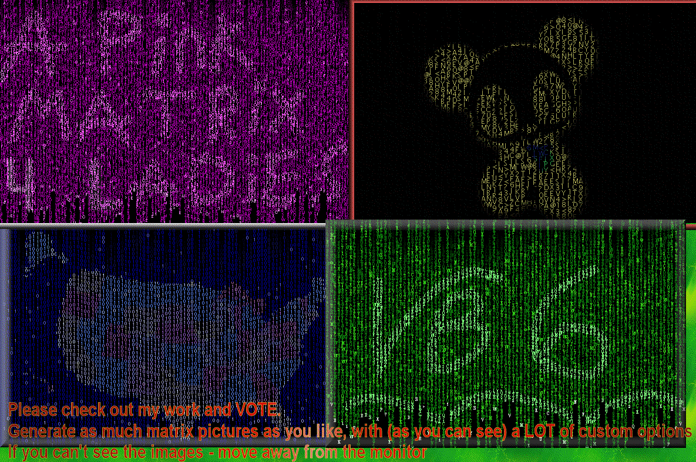



## Matrix Blender \- ALL customizeable \- NO API

### Description

The programm generates "matrix" lines - with user's settings. Then blends the "matrix" with another image in a special way so the image is only blended on the letters. See SCREENSHOT.NO API.Creates Cool effect! Has a lot more features like: Drawing by yourself, choosing transparent color, cusomizing matrix(line length, font, num of lines etc.),select RGB channales to adjust image and more.. please vote
 
### More Info
 

             |
---                |---
**Submitted On**   |2004-07-31 15:12:14
**By**             |[Michael Vainshtein](https://github.com/Planet-Source-Code/PSCIndex/blob/master/ByAuthor/michael-vainshtein.md)
**Level**          |Beginner
**User Rating**    |4.9 (74 globes from 15 users)
**Compatibility**  |VB 5\.0, VB 6\.0
**Category**       |[Graphics](https://github.com/Planet-Source-Code/PSCIndex/blob/master/ByCategory/graphics__1-46.md)
**World**          |[Visual Basic](https://github.com/Planet-Source-Code/PSCIndex/blob/master/ByWorld/visual-basic.md)
**Archive File**   |[Matrix\_Ble177627812004\.zip](https://github.com/Planet-Source-Code/michael-vainshtein-matrix-blender-all-customizeable-no-api__1-55277/archive/master.zip)

